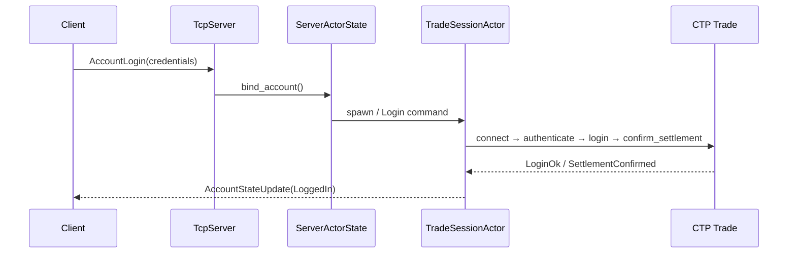
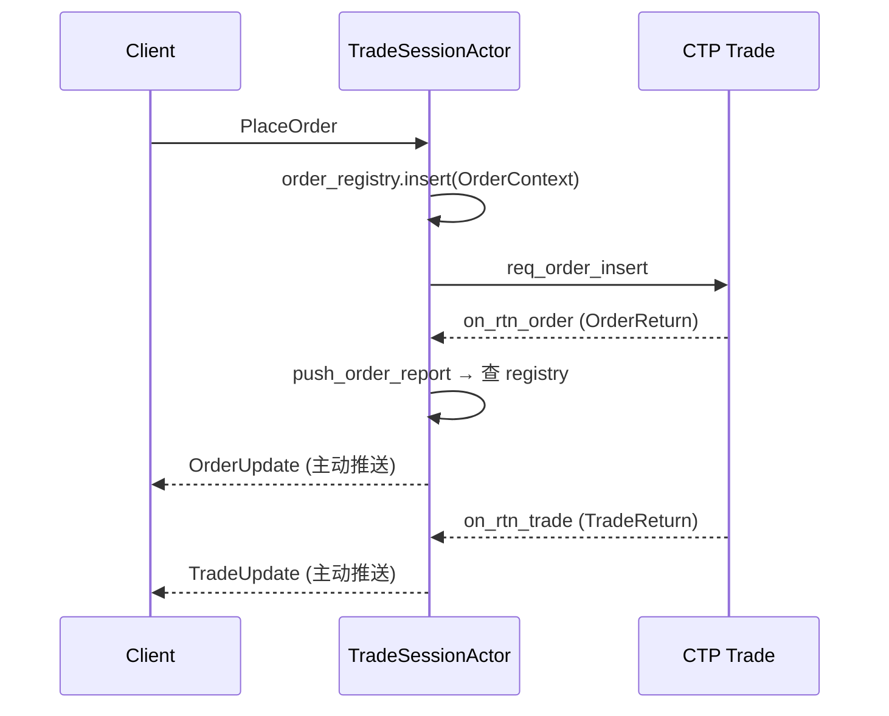
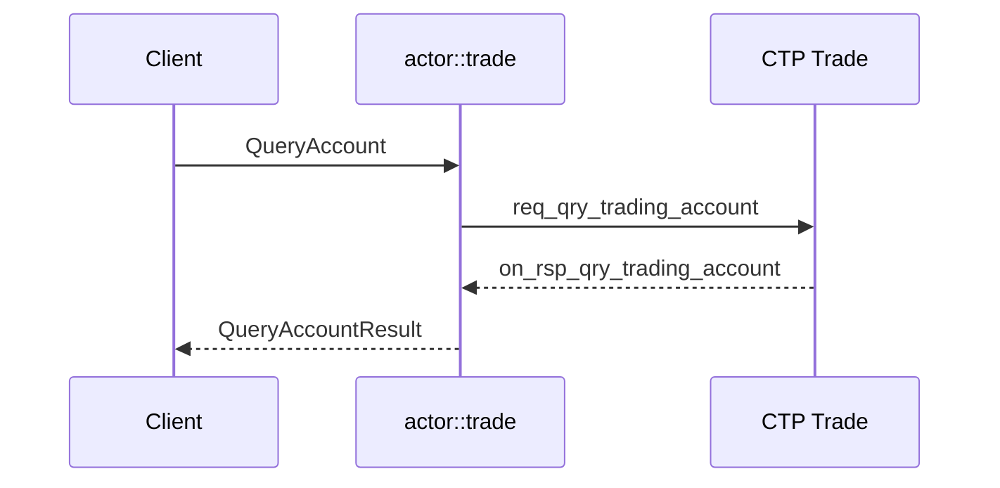

# CTP 多账户交易服务 — 项目架构文档

> 项目：`ctp_system`  
> 对应机试题目：[机试题目-基于CTP接口的多账户交易服务](../机试题目-基于CTP接口的多账户交易服务.md)  
> 更新日期：2026-07-14

---

## 1. 项目概述

基于 **CTP 期货交易接口**（Trade + MD），实现 **多 Client / 单 Server** 的 C/S 架构交易服务。Server 统一管理 CTP 连接与指令执行，Client 作为交易终端向 Server 发送登录、交易、查询、控制指令，并接收回报与推送。

**技术栈**

| 层次 | 技术 |
|------|------|
| 语言 | Rust 2021 |
| 异步运行时 | Tokio |
| CTP 绑定 | `ctp2rs`（动态库 `thostmduserapi_se.so` / `thosttraderapi_se.so`） |
| 通信协议 | TCP + 长度前缀帧 + JSON `Envelope` |
| 日志 | `tracing` + `tracing-subscriber` |
| 测试环境 | SimNow（BrokerID `9999`，支持交易时段 / 7×24） |

**Workspace 结构**

```
ctp_system/
├── Cargo.toml                 # Workspace 根
├── .env                       # 运行时环境变量（前置地址、账号等）
├── docs/                      # 技术文档
├── crates/
│   ├── common/                # 协议、网络、日志
│   ├── model/                 # 领域模型、CTP 映射、回报 DTO
│   ├── server/                # CTP 接入、Actor、TCP 服务
│   └── client/                # 交易/行情终端库与 demo
└── 机试题目-基于CTP接口的多账户交易服务.md
```

---

## 2. 整体架构

### 2.1 逻辑分层

```
┌─────────────────────────────────────────────────────────────────┐
│                         Client 层                                │
│  TradingClient / MarketDataClient → TCP → Server                  │
└───────────────────────────────┬─────────────────────────────────┘
                                │ Envelope (JSON)
┌───────────────────────────────▼─────────────────────────────────┐
│                      Internal Gateway                            │
│  TcpServer :8000 (交易)  |  TcpServer :8001 (行情)               │
└───────────────────────────────┬─────────────────────────────────┘
                                │
┌───────────────────────────────▼─────────────────────────────────┐
│                      Server Actor 层                             │
│  ServerActorState                                                │
│    ├── SessionManager        (Client ↔ Account 映射)             │
│    ├── TradingClientActor    (出站推送通道)                       │
│    ├── TradeSessionActor × N (每账户一个 Tokio 任务)              │
│    └── MarketDataSessionActor × 1 (进程级共享 MD)                 │
└───────────────────────────────┬─────────────────────────────────┘
                                │
┌───────────────────────────────▼─────────────────────────────────┐
│                      Exchange Adapter 层                         │
│  TradeSession (CTP TD SPI)  |  MdSession (CTP MD)               │
└───────────────────────────────┬─────────────────────────────────┘
                                │
┌───────────────────────────────▼─────────────────────────────────┐
│                         CTP 前置                                 │
│  Trade Front (40001)  |  MD Front (40011)  [SimNow 7×24]        │
└─────────────────────────────────────────────────────────────────┘
```

### 2.2 CTP 接入模式：1 MD + N Trade

| 会话类型 | 数量 | 登录账号 | 说明 |
|----------|------|----------|------|
| **MD（行情）** | 1 | `CTP_SERVER_USER_ID` / `CTP_SERVER_PASSWORD` | Server 进程级共享，所有 Client 订阅同一 MD 会话 |
| **Trade（交易）** | N（每 CTP 账户 1 个） | Client `AccountLogin` 携带 | 按 `account_id` 懒创建 `TradeSessionActor` |

Server MD 与 Client 交易账号**分离**：MD 使用服务端专用账号；每个 Client 进程通过 `CTP_CLIENT_ID` 标识自身，并通过 `CTP_CLIENT_USER_ID` / `CTP_CLIENT_PASSWORD` 加载本次启动要登录的交易账号。

### 2.3 Actor 模型

每个 CTP 交易账户对应一个 **`TradeSessionActor`**（独立 Tokio 任务），内部维护：

- `Option<TradeSession>`：CTP 连接（登出时 `take()` 释放）
- `logged_in_ids: Option<(front_id, session_id)>`：登录会话标识（撤单需要）
- `order_registry: HashMap<order_ref_key, OrderContext>`：下单时登记，用于回报路由

主循环使用 `tokio::select!` 并发处理：

1. **命令通道**：Login / PlaceOrder / CancelOrder / Query* / Logout
2. **事件通道**：CTP SPI 回调事件（委托回报、成交回报、查询结果等）

行情侧由 **`MarketDataSessionActor`** 管理唯一的 `MdSession`，按合约聚合订阅后向所有订阅 Client 广播 tick。

### 2.4 指令路由与回报推送

**Client → Server → CTP**

```
Client 发送 Envelope
  → tcp_server 解码
  → ServerActorState 方法（place_order / cancel_order / query_* …）
  → TradeSessionActor.command_tx
  → actor::trade 驱动 CTP API
```

**CTP → Server → Client（主动推送）**

```
CTP on_rtn_order / on_rtn_trade
  → TradeSessionEvent::OrderReturn / TradeReturn
  → order_registry 查找 OrderContext
  → push_envelope_to_client → Message::OrderUpdate / TradeUpdate
```

查询类指令为**请求-响应**模式：Client 发查询 → Server 阻塞等待 CTP 查询 SPI 完成 → 通过同一 TCP 连接的 `reply_to` 通道返回 `Query*Result`。

### 2.5 通信协议

- **帧格式**：`u32 BE length` + JSON payload
- **消息封装**：`ctp_common::Envelope { request_id, client_id, ts, payload }`
- **消息类型**：`ctp_common::Message`（`serde` 标签枚举，`type` + `data`）

| 方向 | 消息 |
|------|------|
| Client → Server | `Hello`, `AccountLogin`, `AccountLogout`, `PlaceOrder`, `CancelOrder`, `QueryAccount`, `QueryPosition`, `QueryOrders`, `QueryTrades`, `MarketDataHello`, `SubscribeMarketData`, `UnsubscribeMarketData` |
| Server → Client | `HelloAck`, `AccountStateUpdate`, `OrderUpdate`, `TradeUpdate`, `Query*Result`, `MarketDataTick`, `Error` |

---

## 3. 核心模块说明

### 3.1 `ctp-model` — 领域模型

| 文件 | 职责 |
|------|------|
| `identifiers.rs` | `AccountId`, `ClientId`, `InstrumentId`, `ClientOrderId` 等强类型 ID |
| `enums.rs` | `Direction`, `OrderStatus`, `ConnectionState`, `ClientPermission` |
| `types.rs` | `AccountCredentials`, `OrderRequest`, `CancelRequest`, `Order`, `Trade`, `Position` |
| `reports.rs` | `OrderContext`, `OrderReport`, `TradeReport`（回报 DTO + 合并逻辑） |
| `ctp.rs` | CTP 字段 ↔ 领域枚举映射（方向、开平、委托状态等） |

### 3.2 `ctp-common` — 基础设施

| 模块 | 职责 |
|------|------|
| `protocol.rs` | Client ↔ Server 线协议定义 |
| `network/tcp_client` | 通用 TCP 客户端（长度前缀读写） |
| `network/ctp_client` | MD 侧 CTP 客户端封装 |
| `logging.rs` | `init_logging` 统一日志初始化 |

### 3.3 `ctp-server` — 服务端

| 模块 | 文件 | 职责 |
|------|------|------|
| Actor 入口 | `actor.rs` | 导出 common / data / trade 三个 Actor 子域 |
| Actor Common | `actor/common.rs` | `SharedServerActorState`、Client 注册、Command 枚举、通用回报推送 |
| Actor Data | `actor/data.rs` | `MarketDataSessionActor`、订阅聚合、CTP MD 登录、tick fanout |
| Actor Trade | `actor/trade.rs` | `TradeSessionActor`、账户绑定、登录、下单、撤单、查询、登出 |
| 会话 | `session.rs` | Client ↔ Account 绑定与连接状态 |
| 配置 | `config.rs` | `ServerConfig` 结构体；MD 凭证读取 |
| TCP | `adapter/internal/tcp_server.rs` | 双端口监听、消息路由 |
| CTP Trade | `adapter/exchange/trade.rs` | TD API 生命周期、SPI、下单/撤单/查询 |
| CTP MD | `adapter/exchange/md.rs` | MD API 连接、订阅 |
| 映射 | `adapter/exchange/mapping.rs` | CTP FFI 字段 → 领域对象 |

### 3.4 `ctp-client` — 客户端

| 模块 | 职责 |
|------|------|
| `trading.rs` | 交易指令 API（登录、下单、撤单、查询、登出） |
| `market_data.rs` | 行情订阅 API |
| `credentials.rs` | 加载当前 Client 实例的交易账号 |
| `connection.rs` | TCP 连接管理 |
| `main.rs` | 联调 Demo：连接 → 登录 → 订阅 → 查询资金 → 下单 → 收回报 |

---

## 4. 关键数据流

### 4.1 账户登录



### 4.2 下单与回报推送



### 4.3 查询（以资金为例）



### 4.4 账户登出

```
Client: AccountLogout
  → TradeSessionCommand::Logout
  → session.take()          // 释放 CTP 连接
  → logged_in_ids = None
  → order_registry.clear()
  → AccountStateUpdate(Disconnected)
```
